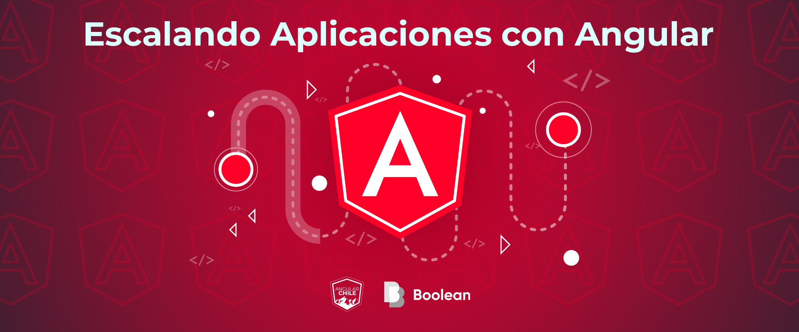
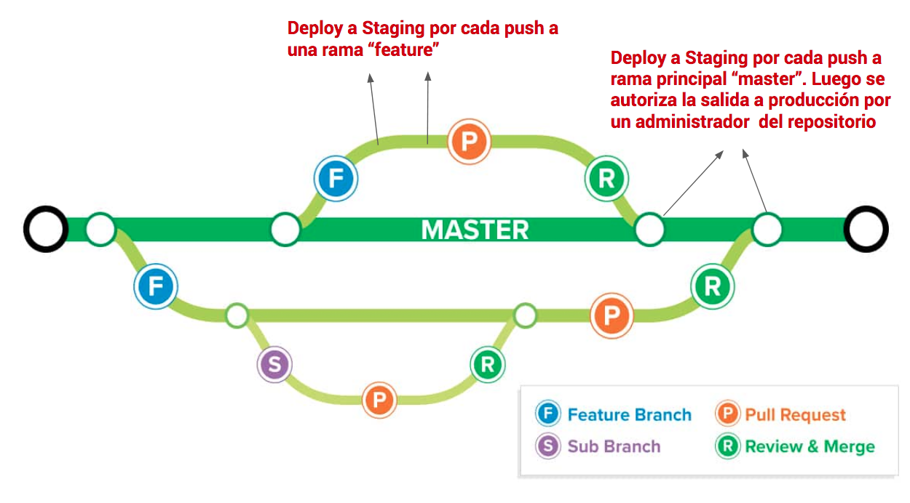

# Escalando Aplicaciones con Angular

> Un repositorio con deuda técnica eterna

  
  
  
  
  
  

Este repositorio es un proyecto vivo que busca lograr que toda la comunidad del software pueda colaborar enseñando a través de artículos, cursos personalizados, etc. e integrando sus códigos a este.

## Pre-requisitos

- Node.js >= 8
- Git básico
- Conocimiento Básico en Angular (sino te recomendamos el [Tutorial Oficial de Angular](https://angular.io/tutorial) para comenzar).

## Antes de comenzar

Para un mejor entendimiento de las herramientas seleccionadas te recomendamos leer la sección [Stack Tecnológico](docs/Stack.md).

## Proceso de Integración Continua

Existen una serie de herramientas gratuitas para proyectos de código libre. En nuestro caso utilizamos las siguientes:

- **CircleCI**: Cada vez que alguien contribuye al proyecto se corre el proceso de integración continua y si todo sale bien, se genera una subida a producción.
- **Heroku**: Plataforma donde desplegamos la aplicación para los ambientes _Staging_ y _Producción_.

Puntualmente se utiliza [Heroku Registry](https://devcenter.heroku.com/articles/container-registry-and-runtime) para correr un contenedor Docker y una aplicación Express que sirve mocks en vez de datos reales (estos mismos mocks son utilizados en el proceso de desarrollo)

El estilo de control de versiones que utiliza este repositorio es `feature-branch` (para más información revisa [este link](https://martinfowler.com/bliki/FeatureBranch.html)) por la cual el flujo de integración continua esta pensado de la siguiente manera:

- Enlace a ambiente de Staging: https://ng-chile-angular-staging.herokuapp.com/
- Enlace a ambiente de Producción: https://ng-chile-angular.herokuapp.com/

## Contribuciones

Para poder contribuir a este proyecto lea estas [instrucciones](CONTRIBUTING.md).

## Autores

- [Gonzalo Pincheira](https://github.com/gpincheiraa)
- [Nicolás Ávila](https://github.com/nicoavila)
- [Sebastián Jiménez](https://github.com/sbstn-jmnz)
- [Maikel Perez](https://github.com/mdperez86s)

### Contribuidores
Gracias a todos quienes han enviado un Pull Request a este repositorio.
<!-- ALL-CONTRIBUTORS-LIST:START - Do not remove or modify this section -->
<!-- prettier-ignore-start -->
<!-- markdownlint-disable -->
<table>
  <tr>
    <td align="center"><a href="https://github.com/gpincheiraa"> <b>gpincheiraa</b></a> <a href="https://github.com/ngChile/escalando-aplicaciones-con-angular/commits?author=gpincheiraa" title="Code">💻</a></td>
    <td align="center"><a href="https://github.com/mdperez86"> <b>mdperez86</b></a> <a href="https://github.com/ngChile/escalando-aplicaciones-con-angular/commits?author=mdperez86" title="Code">💻</a></td>
    <td align="center"><a href="https://github.com/sbstn-jmnz"> <b>sbstn-jmnz</b></a> <a href="https://github.com/ngChile/escalando-aplicaciones-con-angular/commits?author=sbstn-jmnz" title="Code">💻</a></td>
    <td align="center"><a href="https://github.com/YerkoPalma"> <b>YerkoPalma</b></a> <a href="https://github.com/ngChile/escalando-aplicaciones-con-angular/commits?author=YerkoPalma" title="Code">💻</a></td>
    <td align="center"><a href="https://github.com/tacevedo"> <b>tacevedo</b></a> <a href="https://github.com/ngChile/escalando-aplicaciones-con-angular/commits?author=tacevedo" title="Code">💻</a></td>
    <td align="center"><a href="https://github.com/apps/greenkeeper"> <b>greenkeeper[bot]</b></a> <a href="https://github.com/ngChile/escalando-aplicaciones-con-angular/commits?author=greenkeeper[bot]" title="Code">💻</a></td>
    <td align="center"><a href="https://github.com/llekn"> <b>llekn</b></a> <a href="https://github.com/ngChile/escalando-aplicaciones-con-angular/commits?author=llekn" title="Code">💻</a></td>
  </tr>
  <tr>
    <td align="center"><a href="https://github.com/JoZero"> <b>JoZero</b></a> <a href="https://github.com/ngChile/escalando-aplicaciones-con-angular/commits?author=JoZero" title="Code">💻</a></td>
    <td align="center"><a href="https://github.com/sebacaro"> <b>sebacaro</b></a> <a href="https://github.com/ngChile/escalando-aplicaciones-con-angular/commits?author=sebacaro" title="Code">💻</a></td>
    <td align="center"><a href="https://github.com/nicoavila"> <b>nicoavila</b></a> <a href="https://github.com/ngChile/escalando-aplicaciones-con-angular/commits?author=nicoavila" title="Code">💻</a></td>
    <td align="center"><a href="https://github.com/booleanchile"> <b>booleanchile</b></a> <a href="https://github.com/ngChile/escalando-aplicaciones-con-angular/commits?author=booleanchile" title="Code">💻</a></td>
    <td align="center"><a href="https://github.com/glabrat"> <b>glabrat</b></a> <a href="https://github.com/ngChile/escalando-aplicaciones-con-angular/commits?author=glabrat" title="Code">💻</a></td>
    <td align="center"><a href="https://github.com/snyk-bot"> <b>snyk-bot</b></a> <a href="https://github.com/ngChile/escalando-aplicaciones-con-angular/commits?author=snyk-bot" title="Code">💻</a></td>
  </tr>
</table>

<!-- markdownlint-enable -->
<!-- prettier-ignore-end -->
<!-- ALL-CONTRIBUTORS-LIST:END -->

## Contacto

- Siguenos en Twitter: [https://twitter.com/angularChile](https://twitter.com/angularChile)
- Únete al slack de Comunidad Angular: [angular-chile.slack.com](angular-chile.slack.com)

